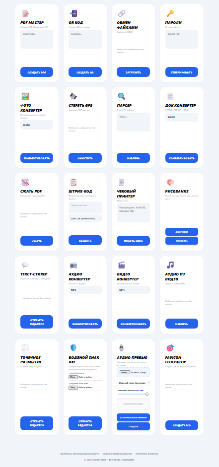

# 🛠️ MicroTools — Профессиональный набор инструментов

Добро пожаловать в **MicroTools** — универсальный сервис, объединяющий удобные и мощные инструменты для работы с медиафайлами, документами и SEO. Все инструменты собраны в одном быстром интерфейсе и работают на базе защищенного выделенного сервера.

🌐 **Зеркало на GitHub:** [https://gitrue.github.io/microtools/](https://gitrue.github.io/microtools/)  
🏠 **Основной сайт:** [https://tools.buskersound.ru](https://tools.buskersound.ru)
---

## 📋 Список инструментов

### 🖼️ Работа с изображениями и ИИ
* **Сжать WebP:** Максимальное сжатие и оптимизация изображений для сайтов.
* **Удалить фон:** Профессиональная ИИ-обработка для автоматического удаления фона.
* **Улучшить фото:** ИИ-апскейлинг — увеличение в 2 раза с восстановлением резкости.
* **Точечное размытие:** Редактор для скрытия лиц, номеров и приватных данных (Blur).
* **Водяной знак XXL:** Наложение защитных логотипов и текста на фото.
* **Favicon Генератор:** Мгновенное создание иконок `.ico` для вашего сайта.
* **Фото Конвертер:** Универсальное преобразование между JPG, PNG, PDF, BMP.
* **Стереть GPS:** Полная очистка EXIF-метаданных для вашей приватности.

### 🎧 Аудио и Видео
* **Аудио Превью:** Защита треков путем наложения голосовой метки через интервал.
* **Аудио Конвертер:** Быстрая смена форматов MP3, WAV, FLAC и других.
* **Видео Конвертер:** Преобразование видеофайлов (MP4, MOV, AVI) онлайн.
* **Извлечь звук:** Качественное отделение аудиодорожки (MP4 в MP3).

### 📄 Документы и PDF
* **PDF Мастер:** Создание PDF-документов с гарантированной поддержкой кириллицы.
* **Сжать PDF:** Уменьшение размера файла без потери качества текста.
* **Подпись онлайн:** Рисование и добавление подписи поверх ваших документов.
* **Док Конвертер:** Преобразование форматов DOCX, PDF, TXT, HTML.
* **Чековый Принтер:** Генерация профессиональных макетов товарных чеков.

### 🔗 Инструменты для бизнеса и SEO
* **QR Код:** Мгновенная генерация кодов из ссылок или текста.
* **Генератор штрих-кодов:** Создание профессиональных штрих-кодов различных форматов.
* **Текст-Стикер:** Редактор для создания графических стикеров с обводкой текста.
* **Парсер контактов:** Автоматическое извлечение Email и телефонов из любого текста.
* **Генератор паролей:** Создание криптостойких паролей с экспортом в .txt.
* **Обмен файлами:** Безопасная передача файлов до 50МБ через короткие ссылки.
* **Курсы Валют:** Актуальные курсы с точным расчетом через официальные API.

---

## 📸 Интерфейс сервиса

  
  

<i>Пример работы инструментов в едином современном интерфейсе</i>

---

## 🔒 Безопасность
Все файлы обрабатываются на нашем сервере и автоматически удаляются после завершения сессии. Мы не храним ваши персональные данные и файлы в открытом доступе.

---
© 2026 **MicroTools**. Все права защищены.

<!--
SEO Keywords: инструменты, файлы, сервис, сжать webp, оптимизация, курс валют, конвертер, удалить фон, png, улучшить фото, резкость, создать pdf, текст в pdf, qr код, генератор qr, передать файл, обмен файлами, пароль, генератор, конвертер фото, jpg в png, удалить gps, exif, парсер, извлечь почту, конвертер документов, docx в pdf, сжать pdf, уменьшить pdf, штрихкод, barcode, создать чек, макет чека, подпись онлайн, подписать pdf, стикер из текста, обводка, конвертер аудио, mp3, конвертер видео, mp4, аудио из видео, размыть фото, блюр, водяной знак, защита фото, защита аудио, превью, фавиконка, ico
-->